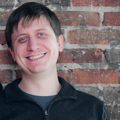

MV* - Model View (Rock)*
========================

* Speaker   : Dusty Jewett
* Available : Any
* Duration  : 45-60 mins

Description
-----------

Backbone, Knockout, Angular, Ember... all of these frameworks impose an Architecture on your application... but before you choose, you should know more about the concepts and patterns underlying and driving the frameworks.  Come learn about MVC, MVP and MVVM, without any frameworks getting in the way!  Understand the pros and cons of each Arch, and how to choose based on your product, team and client.  This talk is a deep-dive into generic UI Architectures, prepare to be inundated with JavaScript code.

Speaker Bio
-----------

Dusty Jewett is a Software Engineer based in Seattle. He loves dynamic languages and compile-time error checking. He has served as the manager of the Web App Developers meetup for 5 years and Lead/Dev Manager for several companies, but finds the "Individual Contributor" role the most rewarding.

Links
-----

* Website: http://dustyjewett.com/
* Github: http://github.com/dustyjewett
* Twitter: http://twitter.com/dustyjewett
